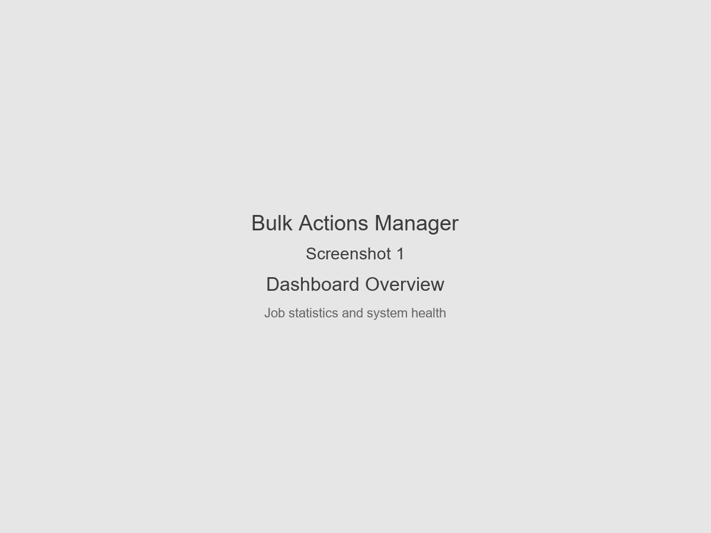
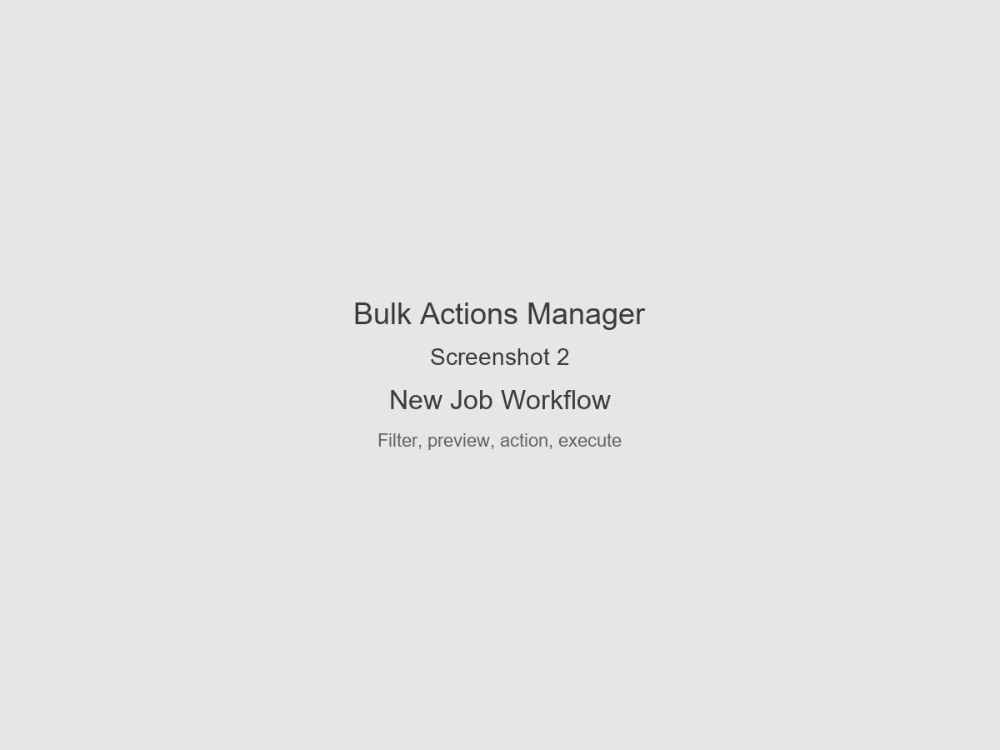
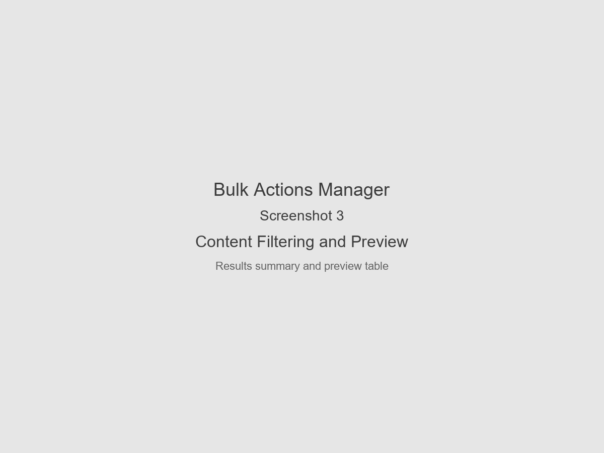
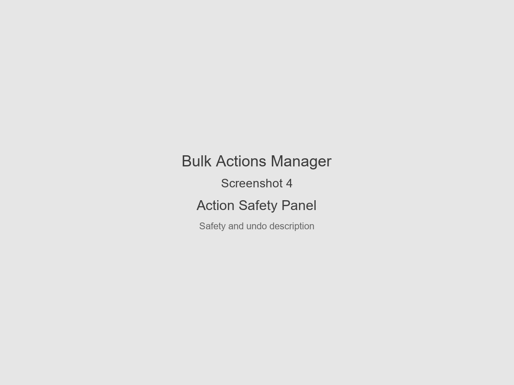
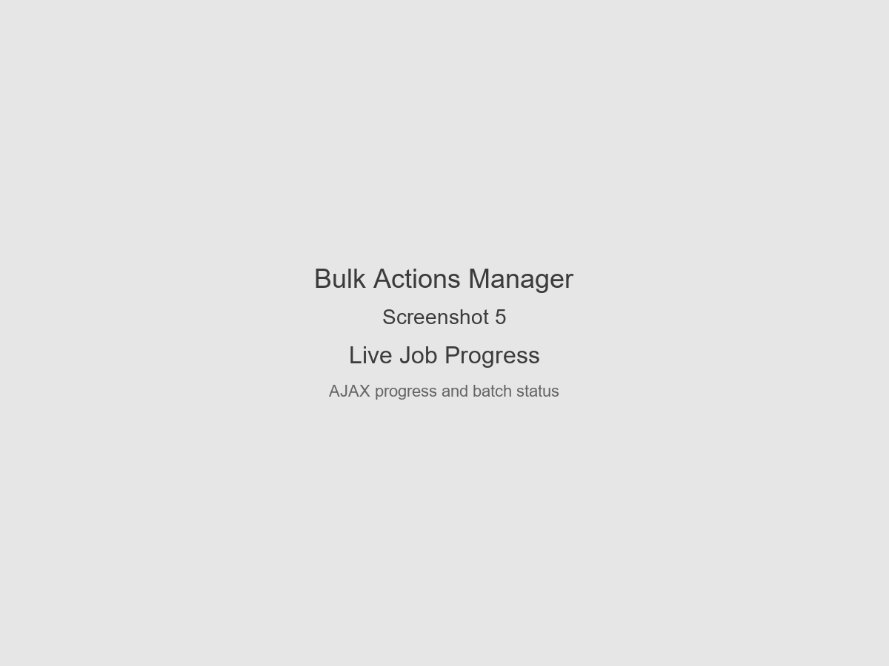
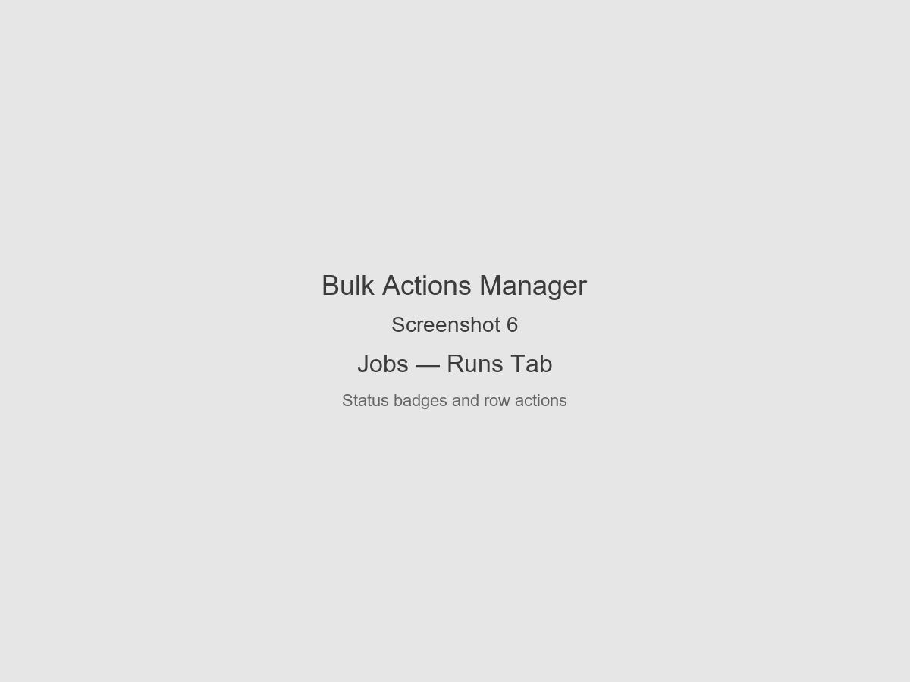
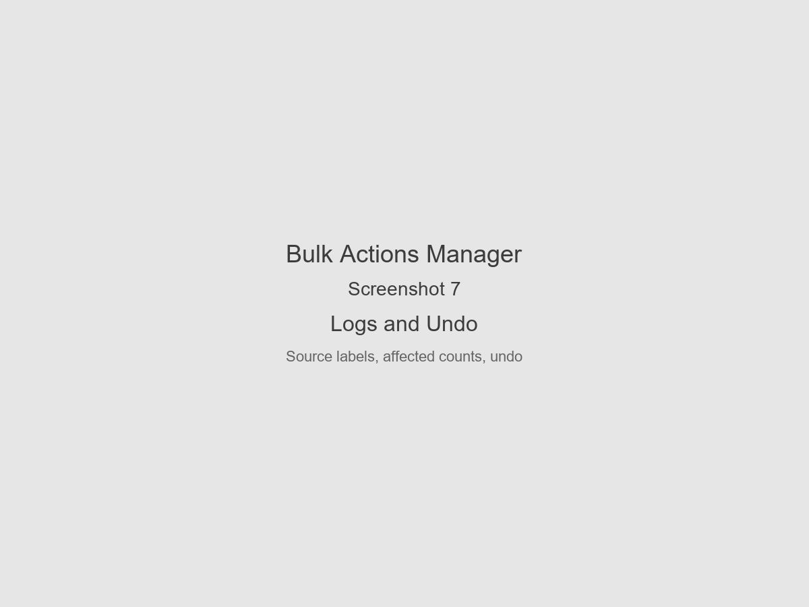
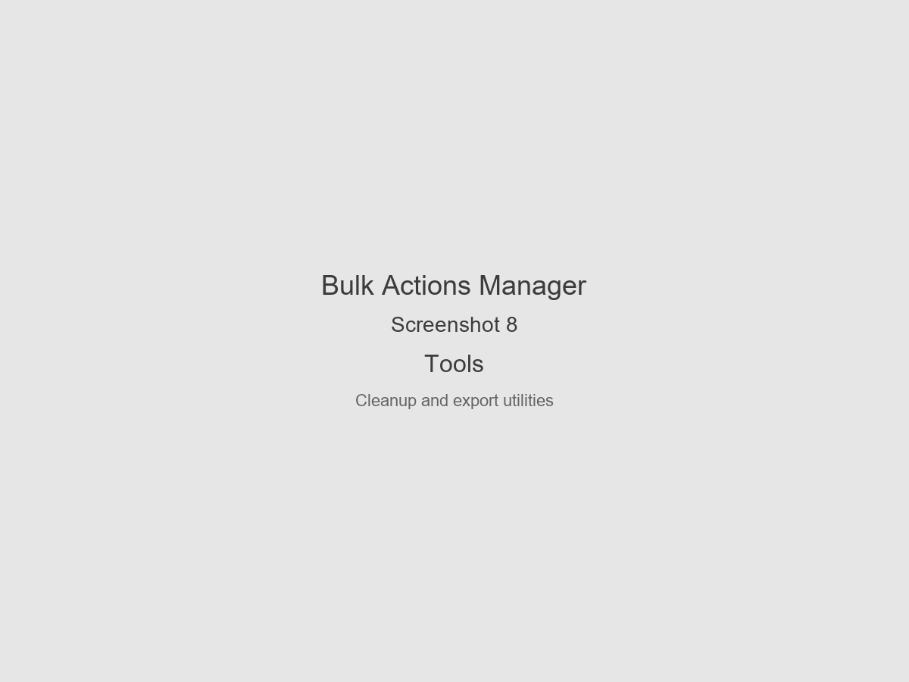
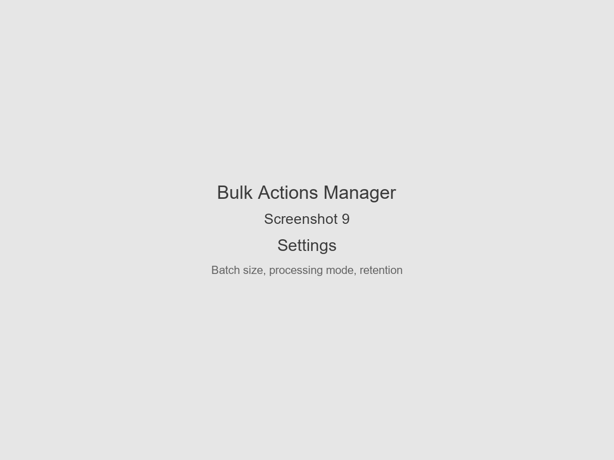

# Bulk Actions Manager

Safely filter, preview, update, export, schedule, and manage WordPress content in bulk using batch processing, audit logs, and undo support.

---

## Overview

Bulk Actions Manager is a free and open-source WordPress plugin for administrators who need bulk operations on posts, pages, media, and custom post types.

Instead of applying large changes immediately, the plugin follows a safe workflow:

```text
Filter → Preview → Action → Process → Log → Undo
```

Every operation can be reviewed before execution, processed in batches to avoid server timeouts, logged for auditing, and reversed when the action supports undo.

**Current version:** 1.3.0 · **Requires:** WordPress 6.0+, PHP 7.4+

---

## Key Features

### Advanced Content Filtering

Filter content using:

* Post type
* Post status
* Categories and tags
* Authors
* Creation and modified dates
* Featured image status
* Title and content search
* Custom fields (meta key / meta value)
* SEO metadata (when Yoast SEO or Rank Math is active)
* Advanced conditions via the Advanced Filters panel and query builder (`AND` / `OR`)

Supported content types:

* Posts
* Pages
* Attachments
* Public custom post types

---

### Preview Before Changes

Preview matching content before executing actions.

Features include:

* Total matching record count
* Results summary (status and category breakdown)
* Paginated preview table
* Dry-run mode
* Preview and dry run options on the New Job screen

No changes are made until a job is started (unless dry run is enabled for simulation only).

---

### Bulk Actions

#### Status Actions

* Publish
* Draft
* Pending Review
* Private

#### Content Actions

* Find and Replace (title, content, excerpt)
* Append Content
* Prepend Content

#### Taxonomy Actions

* Add / Remove / Replace Categories
* Add / Remove / Replace Tags

#### Author Actions

* Change Author

#### Metadata Actions

* Add Meta
* Update Meta
* Remove Meta

#### Media Actions

* Remove Featured Image
* Delete Featured Image File
* Delete Attached Media

#### Delete Actions

* Move to Trash
* Permanently Delete

#### Export Actions

* Export IDs
* Export CSV
* Export JSON

Each action shows a description and safety level (undo supported, recoverable, or cannot be undone) before you run the job.

---

## Batch Processing

Bulk Actions Manager is designed to handle large content sets using batched processing and configurable limits. Advanced sites can further tune limits and behavior using plugin hooks and settings.

Operations run in configurable batches to reduce:

* PHP timeouts
* Memory exhaustion
* Browser timeouts
* Shared hosting limits

### AJAX Processing

Recommended for most sites when an admin screen stays open.

* Live progress bar with pause, resume, and cancel controls

### Background Queue

Recommended for very large jobs that can run without live browser progress.

Uses WP Cron (`bam_process_queue`) for asynchronous, sequential batch processing.

---

## Undo System

Snapshot-based undo for supported actions. Snapshots are stored before changes and can be restored from the **Logs** screen.

### Undo Supported

* Status changes
* Author changes
* Category and tag changes
* Metadata changes
* Featured image removal
* Find and replace
* Move to trash

### Not Undoable

* Permanent delete
* Featured image file deletion
* Attached media file deletion

Destructive actions show clear warnings and confirmations before the job starts.

---

## Audit Logs

Every job creates a log entry with:

* User who ran the job
* Action performed
* Filters used
* Affected record count
* Result status and errors
* Undo availability

---

## Scheduled Jobs

Create and edit recurring jobs from the **New Job** workflow, then manage them from **Jobs → Scheduled**.

Examples:

* Move old posts to draft
* Clean up content matching SEO filters
* Run maintenance actions on a schedule

Supported frequencies:

* Hourly
* Daily
* Weekly
* Monthly

Each scheduled run creates a background job visible under the **Runs** view.

---

## Native WordPress Experience

Built with WordPress administration patterns:

* Native admin UI (postboxes, `form-table`, `widefat` tables)
* `WP_List_Table` for jobs, logs, and previews
* Settings API
* REST API (`bam/v1`)
* WP Cron
* Dashicons
* jQuery UI confirmation dialogs (no browser `alert()` / `confirm()`)

No React build process. No Vue or Bootstrap. No third-party admin UI frameworks.

---

## Requirements

| Requirement | Version |
| ----------- | ------- |
| WordPress | 6.0 or higher (tested through 6.9) |
| PHP | 7.4 or higher |
| MySQL | 5.7 or higher |
| MariaDB | 10.3 or higher |

Administrators receive the `manage_bulk_actions_manager` capability on activation.

---

## Installation

1. Copy the `bulk-actions-manager` folder to:

```text
wp-content/plugins/bulk-actions-manager/
```

The main plugin file must be at `wp-content/plugins/bulk-actions-manager/bulk-actions-manager.php`.

2. Activate the plugin on the WordPress **Plugins** screen.

3. Open **Bulk Actions Manager → New Job**.

4. Configure filters, preview results, choose an action, then start the job or run a dry run.

---

## Admin Menu

```text
Bulk Actions Manager
├── Dashboard
├── New Job
├── Jobs          (Runs + Scheduled)
├── Logs
├── Tools
└── Settings
```

---

## Screenshots

| | |
|---|---|
| **Dashboard** | **New Job workflow** |
|  |  |
| **Filter & preview** | **Action safety panel** |
|  |  |
| **Live job progress** | **Jobs (Runs)** |
|  |  |
| **Logs & undo** | **Tools** |
|  |  |

**Settings**



Save captures as `bulk-actions-manager/screenshot-*.png` - see [docs/SCREENSHOTS.md](docs/SCREENSHOTS.md) for the capture checklist.

---

## Documentation

Detailed documentation lives in the [`docs/`](docs/) directory.

| Document | Description |
| -------- | ----------- |
| [FEATURES.md](docs/FEATURES.md) | Filters, actions, jobs, logs, undo, and tools |
| [CONFIGURATION.md](docs/CONFIGURATION.md) | Settings, permissions, cron, scale limits, uninstall |
| [CHANGELOG.md](docs/CHANGELOG.md) | Release history and upgrade notes |
| [CONTRIBUTING.md](docs/CONTRIBUTING.md) | Contribution guidelines |
| [SCREENSHOTS.md](docs/SCREENSHOTS.md) | Screenshot filenames, URLs, and capture checklist |

WordPress.org plugin readme: [`bulk-actions-manager/readme.txt`](bulk-actions-manager/readme.txt)

---

## Contributing

Bug reports, feature requests, and pull requests are welcome.

Please open an issue before submitting large feature changes. See [CONTRIBUTING.md](docs/CONTRIBUTING.md).

---

## License

GPL-2.0-or-later

This project is free software released under the GNU General Public License. See [LICENSE](LICENSE).

---

## Author

**NomadProgrammer**

* GitHub: [github.com/ProgrammerNomad](https://github.com/ProgrammerNomad)
* Repository: [github.com/ProgrammerNomad/Bulk-Actions-Manager](https://github.com/ProgrammerNomad/Bulk-Actions-Manager)
